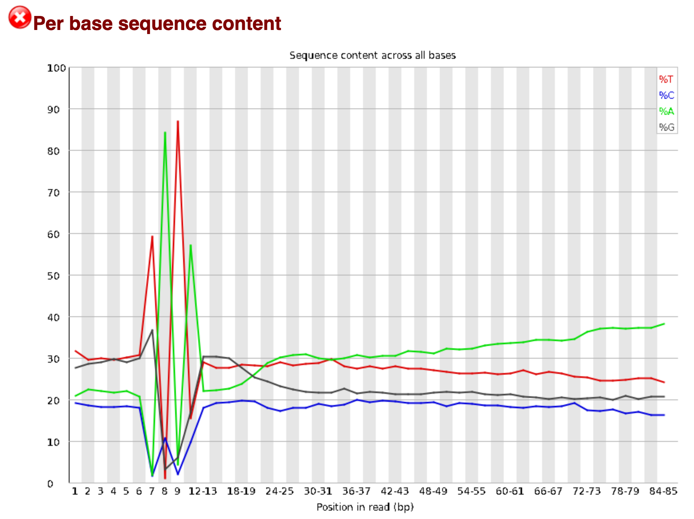

# mtDNA read mapping

This document is intended to describe the approach used for mapping reads and quantifying raw expression values starting from fastq files. This process involves assaying individual sample quality using fastQC, trimming adapter sequences and stretches of low quality basecalls, and then mapping and quantification using rsem. 

## Reference set-up

Before processing the data, the reference genome needs to be set up for mapping. To do this I need the genome sequence file, gene coordinates, and a transcript to gene map to assign isoforms to parent genes. 

The first script below is designed to generate a tab delimited table with with two columns: the first column contains the gene ID and the second column contains a transcript ID linked to that gene. This table is generate from the Ensembl gtf containing the coordinates for genes/transcripts in the human genome.

(*makeEnsmblT2g.sh*)

```bash
#!/bin/bash

grep -P '\ttranscript\t' "$1" | \
        grep 'protein_coding' | \
        grep 'gene_name' | \
        sed 's/.*gene_name "\([^"]\+\)";.*/\1/g' > gNames.tmp

grep -P '\ttranscript\t' "$1" | \
        grep 'protein_coding' | \
        grep 'gene_name' | \
        sed 's/.*transcript_id "\([^"]\+\)";.*/\1/g' > tNames.tmp

grep -P '\ttranscript\t' "$1" | \
        grep 'protein_coding' | \
        grep -v 'gene_name' | \
        sed 's/.*gene_id "\([^"]\+\)";.*/\1/g' > gNames.ngn.tmp

grep -P '\ttranscript\t' "$1" | grep 'protein_coding' | grep -v 'gene_name' | sed 's/.*transcript_id "\([^"]\+\)";.*/\1/g' > tNames.ngn.tmp

grep -P '\ttranscript\t' "$1" | \
        grep -v 'protein_coding' | \
        sed 's/.*gene_id "\([^"]\+\)";.*/\1/g' > gNames.npc.tmp

grep -P '\ttranscript\t' "$1" | \
        grep -v 'protein_coding' | \
        sed 's/.*transcript_id "\([^"]\+\)";.*/\1/g' > tNames.npc.tmp

cat gNames.tmp gNames.ngn.tmp gNames.npc.tmp > gNames.all.tmp

cat tNames.tmp tNames.ngn.tmp tNames.npc.tmp > tNames.all.tmp

paste gNames.all.tmp tNames.all.tmp  > t2g.txt

#rm *.tmp
```


This script was executed in a directory containing the gtf file using the following command:

`makeEnsmblT2g.sh Homo_sapiens.GRCh38.107.chr.gtf`


After generating the transcript to gene map, the genome reference can be prepared. This is done via the rsem command `rsem-prepare-reference`. Specifically, I generated a genome index for the STAR read mapping software, which is what I used in the subsequent mapping step.

(*prepRsemStRef.sh*)

```bash
#!/bin/bash

rsem-prepare-reference --gtf "$1" \
        --transcript-to-gene-map t2g.txt \
        --star -p 1 \
        "$2" "$3"
```


This script was executed in a subdirectory containing the transcript to gene map generated above. The parent directory contained both the gene coordinates file and the genome sequence file. The genome was given the prefix `hsapGenome`

`prepRsemStRef.sh ../Homo_sapiens.GRCh38.107.chr.gtf ../Homo_sapiens.GRCh38.dna_sm.toplevel.fa hsapGenome`


## Running the mapping pipeline

Below is the script used to run the mapping pipeline. This script first generates a FastQC report for all raw read files. It then performs trimming using trimmomatic to remove low quality reads and contaminating adapter sequences. FastQC is then run again to ensure that the trimming step worked well. Then rsem is run, which handles both the mapping (via STAR) and quantification steps.

(*hgBulkRnaMap_mod.sh*)

```bash
#!/bin/bash

shopt -s extglob

prefix="$1"
adapt="$2"


fastqc reads/raw/"$prefix".fastq.gz -o reads/fastqc/pre/

trimmomatic SE -threads 2  -phred33 \
        reads/raw/"$prefix"?(_1).fastq.gz reads/trimmed/"$prefix"_trim.fq.gz \
        ILLUMINACLIP:"$adapt":2:30:10 LEADING:3 TRAILING:3 \
        SLIDINGWINDOW:4:15 MINLEN:36 HEADCROP:12

fastqc reads/trimmed/"$prefix"_trim.fq.gz -o reads/fastqc/post/

cd counts

rsem-calculate-expression --num-threads 2 --no-bam-output --star \
        --temporary-folder "$prefix"_tmp \
        --star-gzipped-read-file \
        ../reads/trimmed/"$prefix"_trim.fq.gz \
        /share/jcazet/analysis/resources/references/human/star/hsapGenome \
        "$prefix"
```

The following wrapper script was used to run the mapping pipeline across all the samples by having it iterate through a list of sample prefixes that each pointed to a fastq file from a specific sample:

(*runMap.sh*)

```bash
#!/bin/bash

while read acc; do
        echo "$acc" 1>>log.txt 2>>err.txt
        ./hgBulkRnaMap_mod.sh "$acc" ../resources/trimAdapt/TruSeq3-SE.fa 1>>log.txt 2>>err.txt
done<prefixList.txt
```

The prefixList file was generated by running the command `ls *gz | sed 's/fastq.gz//g' > prefixList.txt` from within the directory containing the raw read files. The above pipeline was run independently, but with identical settings for the D and UP media samples


Note that the one atypical aspect of the data processing is the inclusion of the `HEADCROP` option in the trimmomatic step. This was included because the FastQC report indicated a systemic problem around basecalls from the 7th-10th position:


There was also a very strong sequence bias in this region:



Because the reads are more than long enough to allow for unique mapping, I simply dropped the first 12 basecalls of all reads to remove these low quality stretches. You can find all the FastQC reports in the `fastqc` directory. The `pre` folders contain the untrimmed reports, and the `post` contains the post-trimming reports.

After the rsem mapping was completed, expression matrices were generated using the command `rsem-generate-data-matrix *genes.results > sup.mat`, which generated a raw count matrix with genes as rows and samples as columns. 


